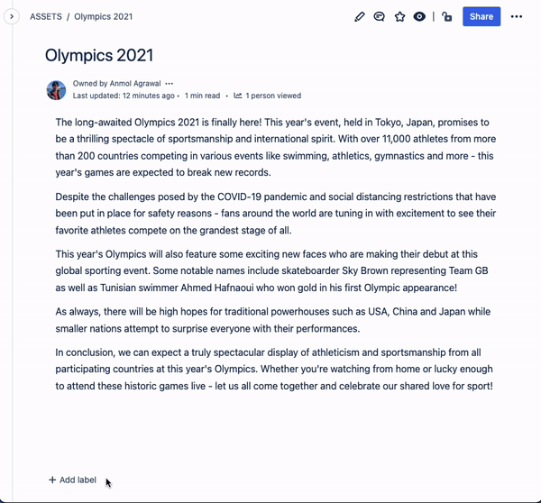

# Confluence keyword extractor app with Forge and OpenAI

If you frequently work with Confluence pages, you may find yourself spending a lot of time manually categorizing and organizing the content. This can be a time-consuming process that takes away from other important tasks. With an app that extracts keywords from your Confluence pages, you can save time and streamline the organization process. Instead of sifting through large quantities of information, simply let the app do the work for you by identifying key themes and topics within your pages.

This is a Forge app that integrates with OpenAI APIs to extract keywords from the content of a Confluence page.

# Prerequisites
Before we get started, make sure you have the following:

- A Confluence Cloud instance where you can install and test your app

- Basic knowledge of JavaScript, React and [Forge platform](https://developer.atlassian.com/platform/forge/getting-started/).

- Completed [Build a Confluence hello world app](https://developer.atlassian.com/platform/forge/build-a-hello-world-app-in-confluence/).

- An OpenAI API key which you can obtain from [OpenAI website](https://platform.openai.com/docs/api-reference/introduction)

# Demo




## Quick start

Here are the steps to try out this app in your Confluence Cloud instance:

- Download this repo:

```
git clone https://github.com/anmolagrwl/forge-ai-confluence-keyword-extractor.git
```

- In your command terminal, enter the directory of the cloned repo:
```
cd forge-ai-confluence-keyword-extractor
```

- Install required npm packages by running:
```
npm install
```

- [Register your app](https://developer.atlassian.com/platform/forge/cli-reference/register/#description). This will create a new unique app ID for your copy of this app. :
```
forge register
```

- Set OpenAI API key as environment variable. An OpenAI API key which you can obtain from [OpenAI website](https://platform.openai.com/docs/api-reference/introduction). You can find your Secret API key in your [User settings](https://platform.openai.com/account/api-keys). Please make sure you have enough [credit balance](https://platform.openai.com/account/billing/overview) to make these OpenAI API calls.:
```
forge variables set --encrypt OPEN_API_KEY your-key
```

- Build and deploy your app by running:
```
forge deploy
```

- Install your app in an Atlassian site by running:
```
forge install
```
&nbsp; &nbsp; &nbsp; Select 'Confluence' as Atlassian product using the arrow keys and press the enter key.

&nbsp; &nbsp; &nbsp; Enter the URL for your development site. For example, example.atlassian.net.

- Once the app is installed, you can go ahead in your Confluence instance mentioned before and try out the app in your sample issue as shown in demo.

### Notes

- Tutorial COMING SOON
- The OpenAI API integration requires developers to use appropriate endpoints and methods, maintain security best practices, and consider potential biases and limitations. Ethical considerations are important to avoid unintended consequences.
- This sample app makes use of OpenAI npm package version 3.3.0. Version 4.x.x of the package is currently incompatible with Forge run time environment.
- This app also includes polyfilling tty.isatty due to a limitation in the Forge runtime.

## Support

See [Get help](https://developer.atlassian.com/platform/forge/get-help/) for how to get help and provide feedback.
If you require any additional help, please don't hesitate to reach out to our [developer community](https://community.developer.atlassian.com/).
